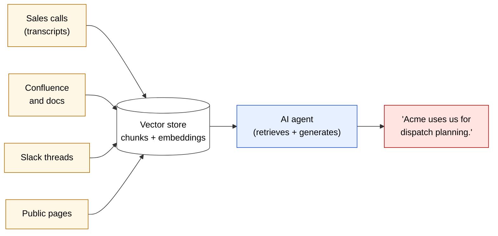
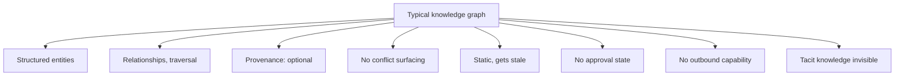
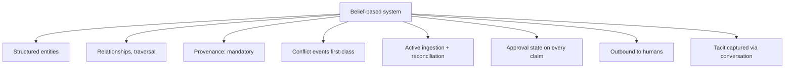
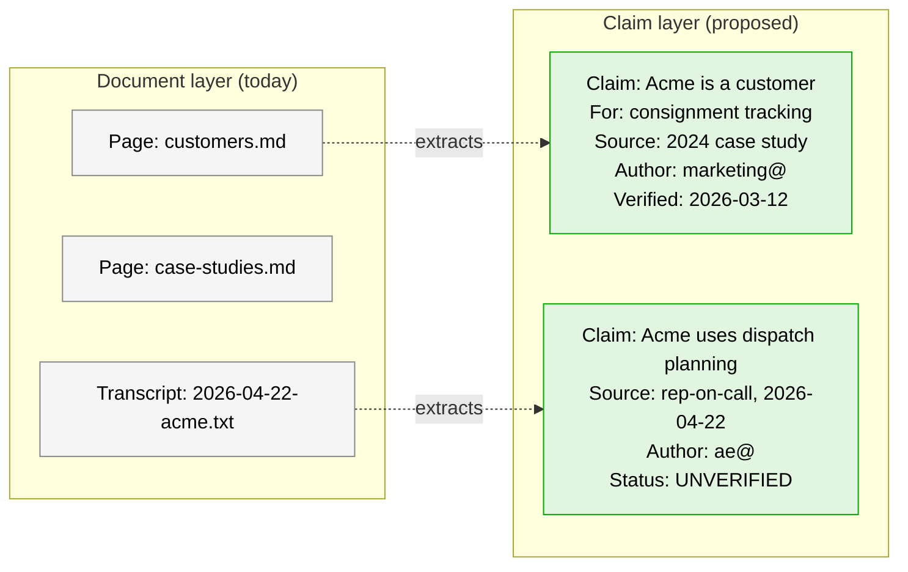
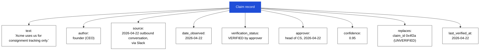
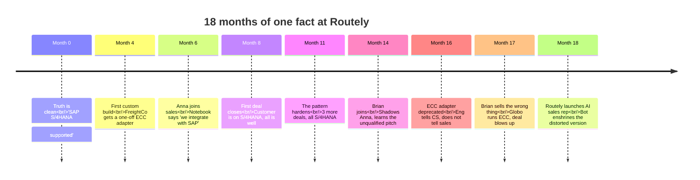
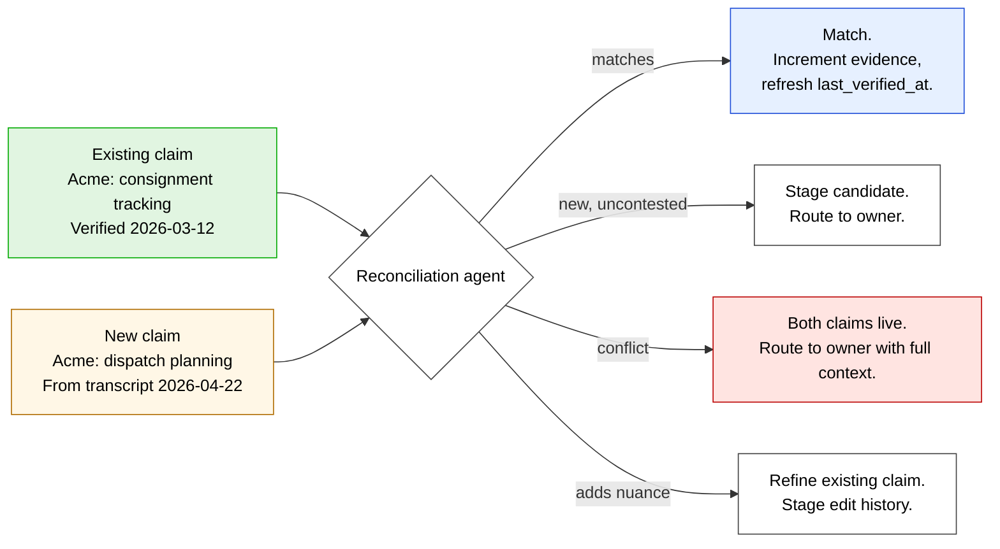
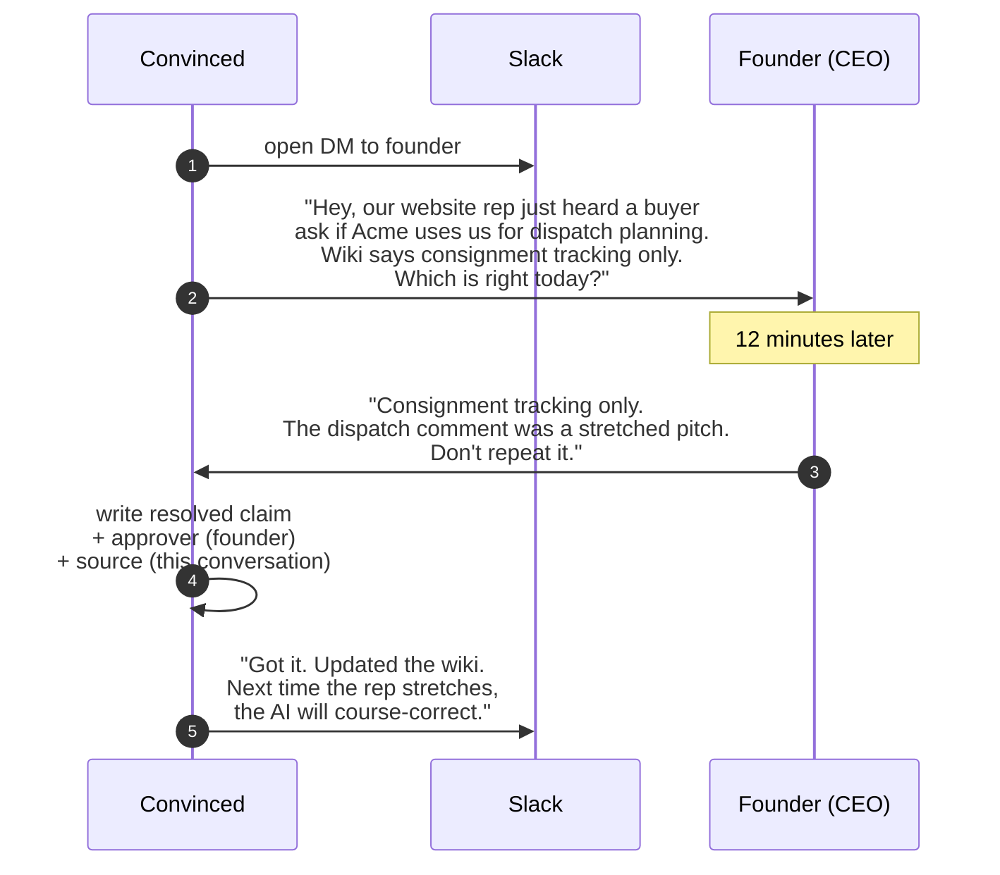
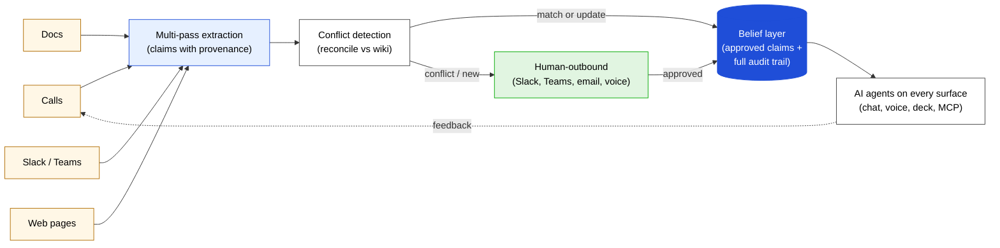

> *"Your AI is better than my best sales reps today. But the customer stories are polluted by what is in our call recordings."*
> — every sales AI customer, ever

---

## 🎬 One real call

Before any theory, one real moment from a customer of mine.

A buyer is on a sales call. Tier 1 auto OEM. Procurement-led. They ask the rep, *"which other auto OEMs use you for dispatch planning?"*

The rep, in the heat of the deal, says: *"Acme uses us for dispatch planning."*

Three things are true about that sentence.

1. Acme is a real customer of theirs.
2. Acme is not an auto OEM.
3. Acme uses the platform for **consignment tracking**, not dispatch planning.

The rep just stretched a real customer relationship into a more impressive one in the most consequential moment of the call. The transcript captured the stretched version. If we had taken that transcript, embedded the chunks, and shipped it to an AI sales rep, the *next* prospect would have heard the same sentence back. And the prospect after that. And the AI would have sounded confident every single time.

This is not a bad rep. This is every B2B rep on every important call. And right now the entire AI-sales-tool industry is built on the assumption that what reps say on calls is true.

This post is about why I no longer believe it, and what to build instead.

I will use this Acme example as the running thread the whole way through.

---

## 📚 What is in your knowledge layer today

The default architecture for AI agents that "know your company" looks like this.

Documents go in. Chunks come out. The agent retrieves the most similar chunks for each question and generates an answer. This is "retrieval-augmented generation", or RAG, and I have built four versions of it. (See the [What is RAG](/posts/what-is-rag) post if you want a primer.)

The architecture has one assumption that breaks the day you ship to a real customer.

**The architecture treats every document as if it were true.**

A chunk that says *"Acme uses us for dispatch planning"* and a chunk that says *"Acme uses us for consignment tracking"* are equally retrievable. The model picks whichever ranks higher. The user never sees the disagreement.

This is the architecture under every "RAG over your wiki" pitch. It is the architecture under most enterprise AI tools shipping today. And it has zero protection against the kind of stretched-truth claim that comes out of a real sales call.

---

## 🕸️ Where typical knowledge graphs fall short

You might be reading this thinking *"we already have a knowledge graph."* Most enterprise teams do, in some form. A Neo4j of customer relationships. An RDF triple store. A Notion database with backlinks. Salesforce's data model. Google's search graph. All variations of *store entities and the relationships between them*.

Knowledge graphs are a real improvement over flat documents. They give you structured queries, traversal, joins. They make you write down *what* the things are and *how* they relate.

But almost every knowledge graph in production today still inherits the document-as-truth assumption. Triples sit there. They look authoritative. Nobody asked the right questions about them.

Six things knowledge graphs typically miss.

**Typical knowledge graph**

**Belief-based system**

**1. Provenance is optional and inconsistent.** Wikidata has the right idea (every statement can carry a `reference`). Most enterprise KGs treat sources as a nice-to-have. A node says *"Acme is a customer"*. Where did that come from? Two years of nobody writing source attributes is two years of claims that are technically *in* the graph but cannot be defended outside it.

**2. No conflict surfacing.** A KG with two contradictory triples will happily return both. The query layer picks one based on aggregation, freshness, or whichever was inserted most recently. There is no alarm, no human-in-the-loop trigger, no surfacing of the disagreement to anyone whose job it is to resolve it.

**3. Static, not living.** Knowledge graphs get built. Then they rot. The bot that scrapes Confluence into the graph runs every Monday. The Slack thread from yesterday that contradicts a node never makes it in. Three months later, the graph is a fossil that nobody updates and everybody reads.

**4. No notion of approval state.** A triple is either present or absent. There is no *proposed*, *verified*, *deprecated*, *quarantined*. The head of product wants to mark a claim as official; the graph has no field for that distinction.

**5. No outbound capability.** Knowledge graphs are passive. They wait for queries. They do not go to humans when they realize they are out of date. The most they will do is flag missing fields in a dashboard nobody opens.

**6. Tacit knowledge is invisible.** KGs only know what has been written down. They have no way to capture what is in a CSM's head, what was decided in a hallway conversation, what one engineer is the only person who remembers about a custom integration that was bent for a single customer two years ago.

A belief-based system is a knowledge graph plus all six of these. Specifically:

- Every triple is a *claim* with mandatory source, author, date, status, approver.
- Two contradictory claims trigger a conflict event with full context.
- The graph stays living because an active ingestion pipeline and a conflict-detection agent keep working on it.
- Approval state is a first-class field, queryable like any other.
- An outbound agent goes to humans on Slack, Teams, email, or voice when the graph realizes it has a gap or a conflict.
- Tacit knowledge gets pulled out of human heads through structured conversation, not by waiting for someone to write it down.

If your knowledge graph today gives you all six, congratulations, you are running a belief-based system. If not, this is probably the upgrade you need.

---

## 🪙 The simple insight

Now the small insight that I think reorganizes everything.

**A document is not a fact. A document is a *claim*.**

A claim is *what one person said on one day for one audience*. Claims have authors. They have dates. They have reasons. They go stale. They contradict each other. They get superseded by a Slack message that nobody added to the wiki.

The first move of a belief-based system is to stop storing documents and start storing claims.

The point of this diagram is the difference between what the two layers *let you ask*.

You cannot ask the document layer "is Acme a dispatch-planning customer?" and get a clean answer. You can ask "find me chunks about Acme and dispatch planning". You will get back chunks. The chunks may agree. They may not. The system will not tell you they disagree.

You can ask the claim layer that question. The answer is *"two claims exist. One says yes, one says no. Here are the sources, the authors, the dates, and the verification status of each."*

Once the layer can tell you it disagrees with itself, the rest of the architecture becomes possible.

---

## 🧬 Anatomy of a claim

Step three. What is the actual shape of a claim?

I will use the same Acme example, properly structured, as one record in the system.

Eight fields. None of them controversial individually. All of them missing in your vector store today.

Look at the `replaces` field. That is how a belief-based system represents history. The earlier "Acme uses us for dispatch planning" claim is not deleted; it is downgraded to UNVERIFIED and its successor is linked. A reader of the system six months from now can see exactly what changed, why, and when.

Look at the `verification_status` field. It is the difference between the system saying *"a chunk says this"* and the system saying *"someone with the right job has approved this".* These are not the same thing. RAG cannot tell you the second one because it does not store it.

This anatomy maps cleanly to a real schema. In my system the entities are called `Fact`, `Claim`, `EntitySource`, `PendingChange`, and `ModerationAction`. The names do not matter. What matters is that **every assertion the AI makes can be traced to a name, a date, and a source**.

---

## 🕰️ Watch a company forget what is true

The cleanest way to see why this matters is to watch a single fact evolve at a real company. Here is a typical 18-month arc, anonymised.

The company is **Routely**, a B2B logistics SaaS. The fact under question is whether they integrate with SAP. SAP comes in two flavours: **S/4HANA** (modern) and **ECC** (legacy, pre-2015). They are different products. An integration with one is not an integration with the other. This distinction matters.

Each step shows what gets claimed, where it gets stored, and what is actually true.

**Month 0, founding.** The product integrates with SAP S/4HANA. One PM owns this fact. The marketing site says *"Connects to your SAP"*. The Confluence page says *"SAP S/4HANA: supported"*. Truth is clean.

**Month 4, first custom build.** Routely lands FreightCo, a logo customer running SAP ECC. Engineering ships a custom adapter just for FreightCo. The CSM who shipped it knows it is a one-off. Internal ticket says *"FreightCo-specific ECC adapter, do not productize without architectural review."* The Confluence page is not updated. The marketing site is not updated.

**Month 6, Anna joins sales.** Anna learns the product from the founder. The founder mentions the FreightCo ECC adapter in passing. Anna writes in her notebook: *"We integrate with SAP."* She does not capture the ECC vs S/4HANA distinction. She does not know yet that it matters.

**Month 8, Anna's first deal.** Anna pitches Acme. Acme asks *"do you do SAP?"* Anna says *"yes"*. Acme happens to run S/4HANA. The standard integration works. Deal closes.

**Month 11, the pattern hardens.** Three more deals close over two months. Every customer happens to be on S/4HANA. Anna's confidence in the unqualified *"yes we integrate with SAP"* hardens. The marketing site still says *"Connects to your SAP"*, no version specificity.

**Month 14, Brian joins.** Brian shadows Anna. He hears the SAP pitch four times. His notebook now also says *"We integrate with SAP."* He never hears the ECC distinction because nobody has said it out loud in the last six months.

**Month 16, the ECC adapter is deprecated.** FreightCo migrated to S/4HANA last quarter. The custom ECC adapter has been unused for three months. Engineering deprecates it to reduce maintenance burden. They tell the head of CS. They do not tell sales. (This is a normal organizational failure: sales did not own ECC, did not need to know it existed, and nobody had a habit of pinging sales about a feature being retired.)

The Confluence page that says *"FreightCo runs on a custom ECC adapter"* is updated to add *"deprecated Q2 2025"*. The marketing site still says *"Connects to your SAP"*.

**Month 17, Brian sells the wrong thing.** Brian pitches Globo. Globo asks *"do you do SAP?"* Brian says *"yes"*. Globo runs SAP ECC. They sign. Implementation fails three weeks later. Refund. Lost trust. Anna has to fly out and apologize.

**Month 18, the AI sales rep ships.** The CEO is tired of the SAP confusion. The team builds an AI sales rep on top of the obvious thing: feed all Confluence pages, all call transcripts (including Anna's and Brian's), all Slack threads into a RAG pipeline. Hook it to a chatbot.

The bot now confidently pitches:

- *"Yes, we integrate with SAP."* (Dozens of transcripts and pages say this.)
- *"FreightCo runs on us."* (True, but the page that explained the ECC adapter is buried in retrieval rank, and the deprecation note is one Confluence page among many.)
- The bot does not know about the deprecation.

A buyer asks the AI rep *"do you support SAP ECC?"* The AI says *"yes"*. The buyer signs. Implementation fails. Brand damage compounds.

This is not a story about bad reps. Anna and Brian are smart professionals who learned the product in good faith. This is a story about how truth degrades through retelling, and how a system that stores documents instead of claims has no immune system against the degradation.

### How a belief-based system catches every step

Now run the same arc with a belief-based system in place from month 0. Each red event becomes a claim event with provenance and a routing rule.

```mermaid
flowchart LR
  classDef good fill:#e1f5e1,stroke:#0a0,color:#000
  classDef catch fill:#fff7e6,stroke:#b06c00,color:#000
  classDef approved fill:#e6f0ff,stroke:#1f4ed8,color:#000

  M0["Month 0<br/>'SAP S/4HANA supported'<br/>verified by PM"]:::good
  M4["Month 4<br/>'Custom ECC for FreightCo'<br/>verified by Eng lead"]:::good
  M6["Month 6<br/>Anna's note<br/>'we integrate with SAP'<br/>conflict: too broad"]:::catch
  M6R["Eng lead refines:<br/>'S/4HANA standard;<br/>ECC custom for FreightCo only'"]:::approved
  M16["Month 16<br/>ECC adapter deprecated<br/>verified by Eng lead"]:::good
  M16R["Outbound to Sales lead:<br/>'sales should know.<br/>Pin update in wiki.'"]:::approved
  M17["Month 17<br/>Brian briefed by wiki:<br/>'ECC: deprecated 2025-Q2'<br/>Globo deal saved"]:::approved
  M18["Month 18<br/>AI rep reads approved layer<br/>says 'no ECC'"]:::approved

  M0 --> M4 --> M6 --> M6R --> M16 --> M16R --> M17 --> M18
```

| Month | What the belief layer does |
|---|---|
| 0 | Stored as: `text="SAP S/4HANA: supported"`, `source=Engineering Confluence page`, `verified_by=PM`, `status=approved`. Marketing claim *"Connects to your SAP"* is stored as a separate claim, `status=unverified` because the unqualified version was never approved. |
| 4 | Engineering's ECC adapter ticket flows through the ingestion pipeline. The new claim `"we integrate with SAP via custom ECC adapter for FreightCo only"` is staged. Verified by the Eng lead. The marketing-site claim is now also flagged as a conflict (it is broader than what is verified) and routed to marketing for refinement. |
| 6 | When Anna writes *"we integrate with SAP"* in her CRM note, the call assistant ingests it. The conflict-detection agent flags: this claim is broader than the verified version. Routes to the Eng lead. Eng lead refines: *"we integrate with SAP S/4HANA standard; ECC requires a custom build, currently only for FreightCo."* Stamped with date and approver. |
| 8, 11 | Every time Anna pitches the unqualified version on calls, the system catches the same conflict during transcript ingestion. Anna's deal-prep brief from the wiki now includes *"SAP: ask which version. ECC requires a custom build."* She starts asking the question on calls; deals still close. |
| 14 | Brian's onboarding pulls from the wiki, not from Anna's tribal knowledge. He learns the qualified version from day one. |
| 16 | When Eng deprecates the ECC adapter, the deprecation gets picked up from the engineering ticket. If for any reason it does not, the outbound agent pings the head of CS asking *"the ECC adapter is unused for 3 months. Is it deprecated? Should sales know?"* The deprecation is recorded with a timestamp and an approver. The wiki entry for ECC moves to `status=deprecated`. Sales gets an automated one-line update. |
| 17 | Brian's deal-prep brief for Globo says *"SAP ECC: deprecated as of Q2 2025. Standard SAP integration is S/4HANA only. If buyer is on ECC, escalate."* Globo is on ECC. Brian asks the question, escalates, no deal blows up. |
| 18 | The AI sales rep reads from the approved claim layer, not from the document layer. The deprecated ECC claim is not retrievable as a current capability; it is in quarantine. The bot says *"we support SAP S/4HANA. ECC is no longer supported as of Q2 2025."* |

The single insight: **a fact is not a fact because it is in a doc. A fact is a fact because someone with the right job has approved it, and nothing more recent has overruled it.**

Every step of the Routely arc is a moment where that approval state should have been updated and was not. A belief-based system makes the approval state mandatory. A document-based system never had it.

---

## ⚡ What happens when claims meet

Step four. The interesting thing happens when two claims about the same topic meet.

In the document layer, this is invisible. Two chunks that disagree both get retrieved. The model picks one. Nobody flags it.

In the claim layer, this becomes a first-class event.

The key point is the third path: **conflict**. The new claim says one thing. The old claim says another. The system does not pick. The system surfaces both, with full provenance, and routes the conflict to whichever human owns that domain.

In our Acme example: the new claim *("dispatch planning")* came from a sales call. The old claim *("consignment tracking only")* came from the marketing-approved case study. Reconciliation flags it. Routes to the head of customer success. The owner sees both versions, both sources, three buttons (Approve, Reject, Refine). Most reviews take under 30 seconds.

This step alone is what kills 80% of the hallucination failure modes I see in the wild. RAG can be 100% faithful to its sources and still 100% wrong, because the sources disagree and nobody in the chain ever asked which one was true.

A 2025 paper from the University of Edinburgh ([Wan et al., RAG with Conflicting Evidence](https://arxiv.org/abs/2504.13079)) measures this exactly. Even strong RAG baselines collapse when retrieved chunks disagree. Their multi-agent reconciliation fix recovers up to 11.4% of accuracy on ambiguous queries. The lesson is that **retrieval that does not handle conflicts is broken by design**.

---

## 🪜 What if the answer is in nobody's documents

Step five. The harder case.

Sometimes both your existing claim and the new claim are wrong. The truth is in nobody's documents. It is in one PM's head, or one CSM's head, or one founder's memory of a deal that closed two years ago.

This is where most "human in the loop" AI tools die. They wait for the human to come to the queue. The human almost never does. The queue grows. The agent keeps pitching the wrong answer in the meanwhile. The loop never closes.

A belief-based system inverts the direction. **The agent goes to the human, on the human's preferred channel, and runs a structured conversation to get the answer.**

This is the part of the architecture that is the hardest to copy and the easiest to underrate.

Most AI knowledge tools index documents and stop there. They have no opinion about how to reach into a human's head when the documents run out, which is exactly when they always do. A belief-based system needs at minimum:

- A way to figure out *which* human to ask, given the topic.
- A way to reach them on the channel they actually use (Slack, Teams, email, voice).
- A structured conversation flow that produces a writable answer.
- A privacy and security wrapper so the conversation does not leak.
- A queue that escalates if the human goes silent.

This is non-trivial infrastructure. We use OpenClaw with NemoClaw on top for privacy and security; the conversation reasoning runs on Claude Sonnet for fast turns and Opus for the harder reconciliations. The exact substrate matters less than the principle: when documents run out, the system goes to humans, not the other way around.

---

## 🧱 The full picture

Putting all five steps together, the architecture for a belief-based system looks like this.

Five pieces:

1. **Multi-pass extraction** turns each new source into atomic claims with provenance.
2. **Conflict detection** reconciles every new claim against the existing belief layer.
3. **Human-outbound** reaches into a human's head when documents run out.
4. **The belief layer itself** stores claims with full audit trails (source, author, date, status, approver, edit history).
5. **AI agents** read from the approved claims, not from the source chunks.

That is it. That is the entire architecture. Nothing here is conceptually exotic; the pieces have lived in different niches of computer science for decades. The thing that is new is how cheap LLMs and orchestration frameworks have made it to do all five at once for an arbitrary company.

---

## 🌍 Where this already works

I am not the first person to think in claims. Belief-based systems are already in production in domains where being wrong has consequences. The places to look:

**Wikipedia.** The largest belief-based knowledge system in the world. Behind the open-edit interface there are three core content policies ([Wikipedia: Verifiability](https://en.wikipedia.org/wiki/Wikipedia:Verifiability), [Neutral Point of View](https://en.wikipedia.org/wiki/Wikipedia:Neutral_point_of_view), [No Original Research](https://en.wikipedia.org/wiki/Wikipedia:No_original_research)) and a deliberation system (Talk pages, Requests for Comment, edit-war arbitration). Every challengeable claim must cite a reliable, published source. The system *knows* it might be wrong and gives readers the tools to evaluate the evidence. That is the model.

**Wikidata.** Even more explicit than Wikipedia. Every statement on Wikidata has a [structured rank](https://www.wikidata.org/wiki/Help:Ranking) (preferred / normal / deprecated), [references](https://www.wikidata.org/wiki/Help:Sources), and qualifiers (effective date, location, etc.). Conflicting statements coexist with explicit ranks. This is the closest formal model to what I am describing.

**Bloomberg Terminal.** Every datum on a Bloomberg page has a source attribution. Press F1 on any value and you can see where it came from, when it was last updated, and the methodology. The terminal is so trusted on Wall Street precisely because it never asks you to take a number on faith.

**Wolfram Alpha.** Curated knowledge with explicit provenance. Each answer comes with a "Sources" expansion that lists exactly which datasets contributed.

**Scientific knowledge graphs.** [Semantic Scholar](https://www.semanticscholar.org/), PubMed, [ClinicalTrials.gov](https://clinicaltrials.gov/). Every claim in scientific literature is cited; meta-analyses explicitly aggregate and rank sources by quality.

**Legal databases.** Westlaw, Lexis. Every case has a citation chain. The chain *is* the knowledge structure.

**Fact-checking pipelines.** [PolitiFact](https://www.politifact.com/), [Snopes](https://www.snopes.com/), [FullFact.org](https://fullfact.org/). All represent claims with structured sources, ratings, and history. The CLEF [CheckThat! shared task](https://checkthat.gitlab.io/) has been driving research on automated claim verification since 2018.

**Logic-of-belief in academia.** The AGM model of belief revision ([Alchourron, Gardenfors, Makinson, 1985, "On the Logic of Theory Change"](https://doi.org/10.2307/2274239), J. Symbolic Logic) is the formal study of how a rational agent should update its beliefs when new evidence arrives. Pearl's [*Probabilistic Reasoning in Intelligent Systems*](https://www.elsevier.com/books/probabilistic-reasoning-in-intelligent-systems/pearl/978-0-08-051489-5) (1988) gave us Bayesian belief networks. The math has been there for forty years; the engineering is what is new.

**In AI specifically.** Anthropic's [Claude](https://www.anthropic.com/news/claude-citations) has shipped citations as a primary feature since 2024. [Perplexity](https://www.perplexity.ai/) built a whole product around source-cited answers. [Vectara](https://www.vectara.com/blog/introducing-the-next-generation-of-vectaras-hallucination-leaderboard) maintains a hallucination leaderboard precisely because grounding to sources is now treated as table stakes. The direction of travel is clear; what is missing is the upstream layer that decides what the trusted sources *are*.

If you squint, every one of these systems is a partial implementation of the same idea: store claims, not documents; track provenance; surface conflicts; let an authorized party arbitrate. The thing that is missing in B2B sales (and in most enterprise AI today) is the production-grade general-purpose version.

---

## 📜 The papers behind this

Here are the papers that pushed me toward the architecture, with proper citations.

**On what knowledge actually is.**

- Plato, *Theaetetus* (~369 BC). The original tripartite analysis: knowledge is justified true belief.
- Edmund Gettier (1963), [*Is Justified True Belief Knowledge?*](https://www.finophd.eu/wp-content/uploads/2018/01/Gettier.pdf), *Analysis* 23(6), 121-123. Three pages that broke the JTB definition by showing that justification can be intact and the proposition true while the connection between them is accidental. RAG systems are Gettier machines.
- Michael Polanyi (1966), *The Tacit Dimension*, University of Chicago Press. Opens with the line *"we can know more than we can tell"*. The most valuable expert knowledge in any company is the part nobody has written down.

**On knowledge in organizations.**

- Ikujiro Nonaka and Hirotaka Takeuchi (1995), *The Knowledge-Creating Company*, Oxford University Press. The SECI model of how tacit knowledge becomes explicit. The "externalization" step (tacit to explicit) is the hardest, and it is exactly the step our human-outbound agent automates.
- Gabriel Szulanski (1996), [*Exploring Internal Stickiness*](https://josephmahoney.web.illinois.edu/BADM%20545_Spring%202008/Paper/Szulanski%20\(1996\).pdf), *Strategic Management Journal* 17(Winter), 27-43. Studied 271 best-practice transfers. The dominant barrier is not motivation; it is causal ambiguity, recipient absorptive capacity, and source credibility. Knowledge does not flow inside firms even when documented.

**On belief revision (the formal version).**

- Carlos Alchourron, Peter Gardenfors, David Makinson (1985), [*On the Logic of Theory Change: Partial Meet Contraction and Revision Functions*](https://doi.org/10.2307/2274239), *Journal of Symbolic Logic* 50(2). The AGM model. The formal study of how a rational agent updates its beliefs. Forty years old, still the reference.
- Judea Pearl (1988), *Probabilistic Reasoning in Intelligent Systems*, Morgan Kaufmann. Bayesian belief networks. The other branch of "represent claims with probabilities and update them under evidence".

**On where RAG actually fails.**

- Magesh, Surani, Dahl, Suzgun, Manning, Ho (2024), [*Hallucination-Free? Assessing the Reliability of Leading AI Legal Research Tools*](https://hai.stanford.edu/news/ai-trial-legal-models-hallucinate-1-out-6-or-more-benchmarking-queries), Stanford HAI. Lexis+ AI and Westlaw AI, both advertising "no hallucinations", hallucinate on 17 to 33 percent of queries with the source documents available. The retrieval is fine. The problem is upstream.
- Liu, Lin, Hewitt, Paranjape, Bevilacqua, Petroni, Liang (2023), [*Lost in the Middle: How Language Models Use Long Contexts*](https://arxiv.org/abs/2307.03172), arXiv:2307.03172. LLMs reliably read the start and end of context and skip the middle. Stuffing fifty transcripts in is worse than carefully picking five.
- Min, Krishna, Lyu, Lewis, Yih, Koh, Iyyer, Zettlemoyer, Hajishirzi (2023), [*FActScore: Fine-grained Atomic Evaluation of Factual Precision in Long Form Text Generation*](https://arxiv.org/abs/2305.14251), EMNLP 2023. Decomposes long generations into atomic claims; ChatGPT scores 58 percent factual precision on biographies even with retrieval.
- Wan, Vlasov, Soundararajan, Hovy, Joty, Smith (2025), [*RAG with Conflicting Evidence*](https://arxiv.org/abs/2504.13079), arXiv:2504.13079. Models silently pick winners when retrieved chunks disagree; multi-agent reconciliation recovers 11.4 percent on ambiguous queries.

**On the cost of getting it wrong.**

- *Moffatt v. Air Canada* (2024), British Columbia Civil Resolution Tribunal. The case that put dollar liability on chatbot hallucination. Coverage at [CBS News](https://www.cbsnews.com/news/aircanada-chatbot-discount-customer/) and [American Bar Association](https://www.americanbar.org/groups/business_law/resources/business-law-today/2024-february/bc-tribunal-confirms-companies-remain-liable-information-provided-ai-chatbot/).
- AI Incident Database, [Cursor support bot fabricates policy](https://incidentdatabase.ai/cite/1039/) (April 2025).
- McDonald's [terminating its IBM-powered AI drive-thru](https://www.cnbc.com/2024/06/17/mcdonalds-to-end-ibm-ai-drive-thru-test.html) after viral order failures, June 2024.

If you read three of those, read Gettier (3 pages, life-changing), the Stanford legal RAG study (10 pages, sobering), and the Wikidata ranking documentation (it is the closest open-source implementation of what I am describing).

---

## 🧪 What I am building with it

I am applying this architecture to one wedge first: technical B2B sales. The product is called Convinced. We are four months in, with a paying customer and a paid pilot.

The five pieces map directly to what I described in the architecture diagram:

- The Temporal-orchestrated multi-pass ingestion engine reads every new call, doc, Slack thread, and web page.
- The conflict-detection agent reconciles every new claim against the wiki and surfaces contradictions with full provenance.
- The human-outbound agent goes to the right guardian on Slack, Teams, email, or voice when documents run out.
- The belief layer is a knowledge graph indexed around pains, solutions, and customer stories (not features), with full audit trails on every claim.
- The AI agents read from approved claims and serve them on the website widget, the voice agent, internal sales bots, and a public MCP layer that the customer's third-party vendors consume directly.

The longer version of the argument lives at [getconvinced.ai/research](https://getconvinced.ai/research). The short version is that **once you stop treating documents as truth, every layer of the AI stack changes shape**.

---

## 🪞 Why I think this is the way to go

The reason I am betting four months on this is not that B2B sales is the most important market for the architecture. It is that **once you start thinking in claims, you cannot stop noticing the places this matters**.

A buyer-side procurement copilot that fact-checks vendor claims in real time during a deal. Same architecture, opposite buyer.

An M&A diligence agent that interviews employees of acquisition targets, reconciles their answers against the data room, surfaces red flags before close. Compresses 12 weeks of diligence into two.

A compliance-grade RAG layer for pharma, finance, defense, healthcare. Markets where current AI tools fail their first audit.

A founder-brain backup that captures the tacit knowledge of a key person before they leave, get acquired out, or step back.

A real-time truth coach that whispers to a sales rep through their AirPods when they are about to say something that is not in the verified brain.

I do not think any of these are 10-year visions. I think they are 18-month markets. Each one is blocked today by the same missing infra layer, and every one of them collapses into a feature on top of a belief-based system.

The infra layer is a system that:

1. Models knowledge as claims with full provenance.
2. Surfaces conflicts instead of silently picking winners.
3. Reaches into human heads when documents run out.
4. Tracks gaps as first-class entities.

Build that, and a hundred AI applications stop being demos and start being production-ready.

---

## 🧭 Closing

I started this project thinking the hard problem was *reading more*. Every doc, every call, every Slack thread, fed into a smart AI. Out comes an AI sales rep.

I was wrong twice. First, the AI kept saying things that were not true. Second, even when the facts were right, the AI sounded like a brochure.

Sometime around February of this year, I stopped trying to fix retrieval and started trying to fix the data layer. That was the unlock.

Documents are claims. Claims have provenance. Knowledge is what someone with the right job has approved. Once that is your data layer, the AI starts behaving like a colleague instead of a search engine.

I do not know if the broader infrastructure will be called "belief-based systems" or "claim graphs" or something nobody has named yet. I just know the document-as-truth assumption breaks under every AI agent that makes it to production at scale, and the teams that figure out the alternative early are going to ship things the rest cannot.

If you are building in this shape, send me a note. The crowd of people thinking hard about this is still small, and I would rather compare notes one founder at a time than re-derive the same lessons.
