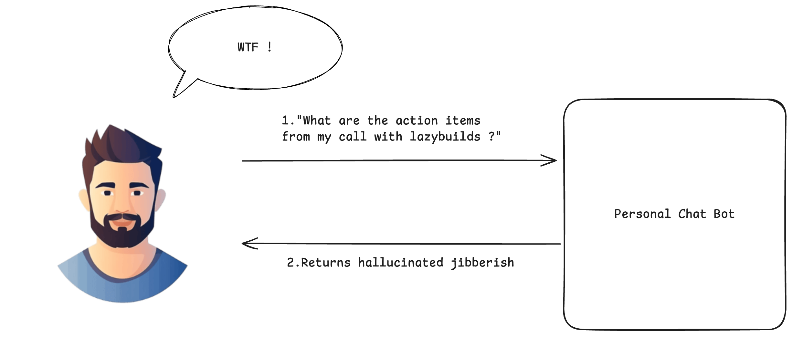
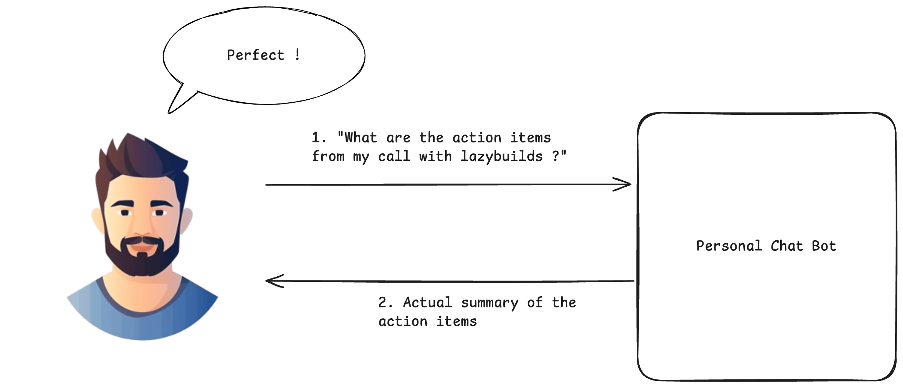
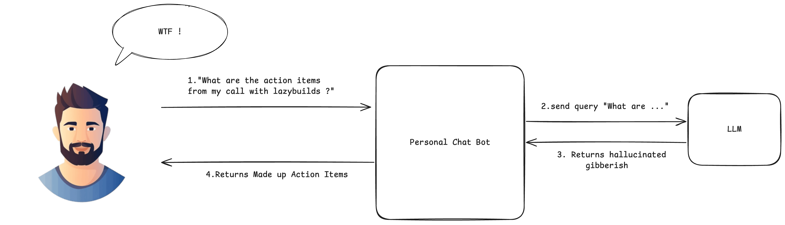
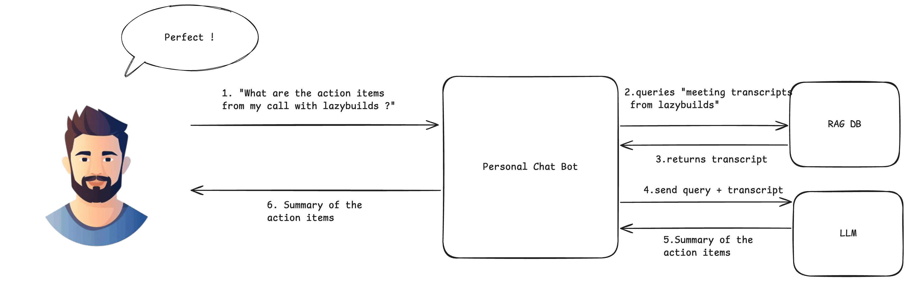

## Description

RAG is what happens when an LLM gets a library card. Instead of guessing from memory, it looks things up first and then answers—like an open‑book exam where the teacher actually wants you to use the book.

Picture this: you ask, "What are the action items from my call with lazybuilds?" Your personal bot doesn’t wing it. It fetches the transcript, pulls the relevant bits, and replies with receipts. That, in one sentence, is RAG.

## Why it's needed

- LLMs have a knowledge cutoff and sometimes improvise facts like confident jazz solos.
- Teams need answers from private, changing sources (policies, code, tickets, research notes).
- Regulated domains want sources and receipts; RAG provides citations you can point to.
- Updating a knowledge base is fast and cheap; retraining models is neither.

Here’s the difference at a glance:



*Without RAG: The LLM makes educated guesses from its training data, leading to potential hallucinations.*



*With RAG: The LLM retrieves relevant information first, then provides grounded answers based on actual data.*

## Benefits of RAG

- Grounded answers: Fewer hallucinations, more reality.
- Fresh knowledge: Bring in new or private data without touching model weights.
- Explainability: Cite the docs so reviewers and auditors can sleep at night.
- Cost and agility: Tune your corpus, not your checkpoint.
- Access control: Respect who can see what, even at the chunk level.

## How it works

1. Ingest and index: Split docs into tidy chunks, embed them, store with metadata and permissions.
2. Retrieve: Turn the question into an embedding and fetch top‑k relevant chunks (semantic or hybrid search).
3. Build the prompt: Question + retrieved context (+ instructions/history) → a grounded prompt.
4. Generate: The LLM answers using that context instead of pure vibes.
5. Post‑process: Add citations, filter/rerank, log feedback to improve over time.

Story mode (30 seconds):
- You ask the question.
- The bot searches your knowledge base for relevant chunks.
- It builds a prompt that includes those chunks plus your question.
- The LLM answers, citing the sources it used.

<!-- moved after-section below to avoid spoilers -->

## What happens without RAG (the before scenario)

Let's break down what goes wrong when we try to answer domain-specific questions without RAG:



**The problematic flow:**
1. **User asks**: "What are the action items from my call with lazybuilds?"
2. **Direct to LLM**: The question goes straight to the language model without any context retrieval
3. **LLM hallucinates**: Since it has no access to the actual meeting transcript, it makes up plausible-sounding action items based on its training data
4. **Unreliable response**: The user gets a confident-sounding but completely fabricated answer

**The transcript problem**: Without RAG, the LLM has no way to access your meeting transcripts, company policies, or any real-time data. It's like asking someone to summarize a meeting they weren't in—they might give you a coherent answer, but it won't be based on reality.

**The RAG solution**: Now with the transcript added to the query context, the LLM receives both:
- The user's question about action items
- The actual meeting transcript content
- Combined, this creates a grounded prompt that produces accurate, verifiable responses

This is why RAG transforms chat bots from confident guessers into reliable assistants that can actually cite their sources.

## RAG full flow (the after scenario)



*With RAG: The bot retrieves the meeting transcript, builds a grounded prompt, and the LLM produces an answer with citations.*

## Pros and cons

### Pros
- Far fewer hallucinations thanks to grounding.
- Stays current without retraining.
- Naturally supports citations and audits.
- Plays nicely with permissions and data boundaries.

### Cons
- Garbage in, garbage out: weak retrieval = weak answers.
- Needs a real data pipeline (chunking, embeddings, indexing, monitoring).
- Context windows are finite; chunking and prompt design matter.
- Handle sensitive data and access control carefully end‑to‑end.

---

Tip: In production, watch retrieval relevance, latency, and answer quality. Iterate on chunking, embedding models, and ranking like you’re tuning a good espresso.

## Code examples (toy RAG)

These are intentionally minimal so you can swap in your actual stack later.

### Python

```python
# Toy RAG example tailored to the "lazybuilds" transcript use case
from typing import List, Tuple

def embed(text: str) -> List[float]:
    # Placeholder: call your embedding model here
    return [hash(text) % 997 / 997.0]

def cosine(a: List[float], b: List[float]) -> float:
    # 1D toy cosine because our embed above is 1D; replace with numpy/scipy
    return (a[0] * b[0]) / ((abs(a[0]) + 1e-9) * (abs(b[0]) + 1e-9))

# Pretend these are transcript chunks from meetings with lazybuilds
corpus = [
    ("call-2025-10-10", "Action: send API keys to lazybuilds; Owner: lazycoder1; Due: Friday"),
    ("call-2025-10-03", "Action: prepare demo of personal chat bot; Owner: lazycoder1; Due: next week"),
    ("call-2025-09-27", "Note: discuss vector DB options; Action: compare pgvector vs Chroma"),
]

def retrieve(query: str, k: int = 2) -> List[Tuple[str, str]]:
    qv = embed(query)
    scored = [(cosine(qv, embed(text)), (doc_id, text)) for doc_id, text in corpus]
    scored.sort(key=lambda t: t[0], reverse=True)
    return [pair for _, pair in scored[:k]]

def build_prompt(question: str, context_docs: List[Tuple[str, str]]) -> str:
    ctx = "\n\n".join(f"[{doc_id}] {text}" for doc_id, text in context_docs)
    return (
        "Summarize concrete action items from the meeting transcripts. "
        "Output as a short bullet list with owners and due dates.\n\n"
        f"Context:\n{ctx}\n\nQuestion: {question}\nAnswer:"
    )

def llm_generate(prompt: str) -> str:
    # Placeholder: call your LLM here (OpenAI, Anthropic, local, etc.)
    return "- Send API keys to lazybuilds — Owner: lazycoder1 — Due: Friday\n- Prepare personal chat bot demo — Owner: lazycoder1 — Due: next week"

def rag_answer(question: str) -> str:
    docs = retrieve(question, k=3)
    prompt = build_prompt(question, docs)
    return llm_generate(prompt)

if __name__ == "__main__":
    print(rag_answer("What are the action items from my call with lazybuilds?"))
```

### TypeScript

```ts
// Toy RAG example tailored to the "lazybuilds" transcript use case
type Doc = { id: string; text: string };

interface VectorStore {
  query: (q: string, k?: number) => Promise<Doc[]>;
}

interface LLM {
  generate: (prompt: string) => Promise<string>;
}

function buildPrompt(question: string, docs: Doc[]): string {
  const ctx = docs.map(d => `[${d.id}] ${d.text}`).join("\n\n");
  return (
    "Summarize concrete action items from the meeting transcripts. " +
    "Output as a short bullet list with owners and due dates.\n\n" +
    `Context:\n${ctx}\n\nQuestion: ${question}\nAnswer:`
  );
}

export async function retrieveAndGenerate(
  question: string,
  vectorStore: VectorStore,
  llm: LLM,
  k: number = 3
): Promise<string> {
  const docs = await vectorStore.query(question, k);
  const prompt = buildPrompt(question, docs);
  return llm.generate(prompt);
}

// Example usage (pseudo):
// const answer = await retrieveAndGenerate(
//   "What are the action items from my call with lazybuilds?",
//   myStore,
//   myLLM
// );
// console.log(answer);
```